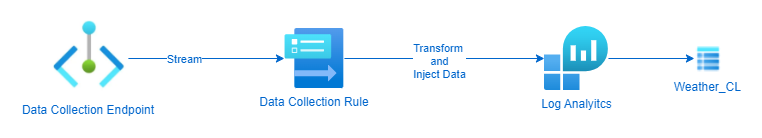
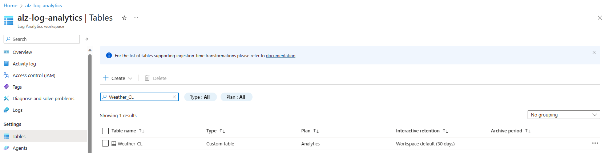
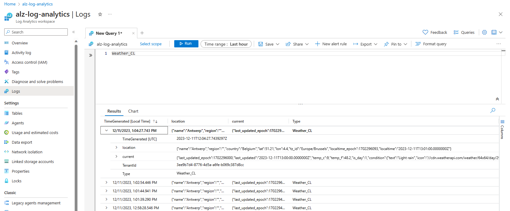

## Introduction

In my organization, we often collect custom data in Azure Monitor Logs. On those logs, we create insights in Azure Monitor Workbooks or create Azure Monitor Alerts upon the loghs.

This post describes how to inject log data in a `Log Analytics workspace` using the `Azure Monitor` [Data Collector API]:

[Data Collector API]:https://learn.microsoft.com/en-us/azure/azure-monitor/logs/logs-ingestion-api-overview


### Flow

I will ingest data from weather data that is collected from the [Weather API] API.

[Weather API]:https://www.weatherapi.com/



1. Post the content of a `json` file from all `Azure Resources` to the `Data Collection Endpoint`
2. Use the `Data Collection Rule` to transform the data and stream to a `Log Analytics workspace` `Weather_CL` custom table.

## The Setup

### Log Analytics workspace Weather_CL table


In order to ingest data we have to setup a `Log Analytics workspace` custom table with a predefined schema. 

Here is the schema I used to create the table:

`table.json`
``` json
{
    "properties": {
        "schema": {
            "name": "Weather_CL",
            "columns": [
                {
                    "name": "TimeGenerated",
                    "type": "datetime",
                    "description": "The time at which the data was generated"
                },
                {
                    "name": "location",
                    "type": "dynamic"
                },
                {
                    "name": "current",
                    "type": "dynamic"
                }
            ]
        }
    }
}
```

There are [a few ways to create a Log Analytics Custom Table] using the Portal, API, CLI or PowerShell.

[a few ways to create a Log Analytics Custom Table]:https://learn.microsoft.com/en-us/azure/azure-monitor/logs/create-custom-table?tabs=azure-powershell-1%2Cazure-portal-2%2Cazure-portal-3

For this example I used the `PowerShell` way with the `Invoke-RestMethod`

``` powershell
# variables
$resourceGroup = "<your resource group>"
$logAnalyticsworkspaceId = "<your Log Analytics workspace Resource Id>"
$tableName = "Weather_CL"

function get-azCachedAccessToken() {
    $currentAzureContext = Get-AzContext
    $azProfile = [Microsoft.Azure.Commands.Common.Authentication.Abstractions.AzureRmProfileProvider]::Instance.Profile
    $profileClient = New-Object Microsoft.Azure.Commands.ResourceManager.Common.RMProfileClient($azProfile)
    $token = $profileClient.AcquireAccessToken($currentAzureContext.Tenant.TenantId)
    $token.AccessToken
}

# create authentication header
$token = get-azCachedAccessToken 
$authHeader = @{
    'Authorization' = "Bearer $token"
    'Content-Type'  = "application/json"
}

# create table
Write-Output "Creating new table '$tableName'.."
$uri = "https://management.azure.com$($logAnalyticsworkspaceId)/tables/$($tableName)?api-version=2021-12-01-preview"
$jsonBody = [String](Get-Content -Path .\table.json)
Invoke-RestMethod -Method Put -Uri $uri -Headers $authHeader -Body $jsonBody 
```

The result is a `custom Log Analyitcs workspace Table`:



### Data collection endpoint


To have an endpoint to send our data to, we have to setup a `Data collection endpoint`.

To setup the `Data collection endpoint`, I use this ARM template:

`dataCollectionEndpoint.json`

``` json
{
    "$schema": "https://schema.management.azure.com/schemas/2019-04-01/deploymentTemplate.json#",
    "contentVersion": "1.0.0.0",
    "parameters": {
        "dataCollectionEndpointName": {
            "type": "string",
            "metadata": {
                "description": "Specifies the name of the Data Collection Endpoint to create."
            }
        },
        "location": {
            "type": "string",
            "defaultValue": "westeurope",
            "allowedValues": [
                "westus2",
                "eastus2",
                "eastus2euap",
                "westeurope"
            ],
            "metadata": {
                "description": "Specifies the location in which to create the Data Collection Endpoint."
            }
        }
    },
    "resources": [
        {
            "type": "Microsoft.Insights/dataCollectionEndpoints",
            "name": "[parameters('dataCollectionEndpointName')]",
            "location": "[parameters('location')]",
            "apiVersion": "2021-04-01",
            "properties": {
                "networkAcls": {
                "publicNetworkAccess": "Enabled"
                }
            }
        }
    ],
    "outputs": {
        "dataCollectionEndpointId": {
            "type": "string",
            "value": "[resourceId('Microsoft.Insights/dataCollectionEndpoints', parameters('dataCollectionEndpointName'))]"
        }
    }
}
```

and use the following PowerShell script to deploy:

``` PowerShell
# variables
$location = "<your deployment location>"
$resourceGroup = "<your resource group>"
$dataCollectionEndpointName = "<your data collection endpoint name>"

# deploy dataCollectionEndpoint 
Write-Output "Deploying Data Collection Endpoint '$dataCollectionEndpointName'.."
New-AzResourceGroupDeployment -ResourceGroupName $resourceGroup -Name "D_dataCollectionEndpoint" -TemplateFile .\dataCollectionEndpoint.json `
    -dataCollectionEndpointName $dataCollectionEndpointName `
    -location $location 
```

### Data collection rule


This is where the magic happens, with the Data collection rule, we can setup:

- **dataCollectionEndpointId**: the `resourceId` of the `Data collection endpoint` created earlier
- **streamDeclarations**: This unique handle describes a set of data sources that will be transformed and schematized as one type. Each data source requires one or more streams, and one stream can be used by multiple data sources. All data sources in a stream share a common schema. Use multiple streams, for example, when you want to send a particular data source to multiple tables in the same `Log Analytics workspace`. 
Define a schema for the source of data. This is the schema of the `Resources`  query that we fetched from `Azure Resource Graph`
- **destinations**: This section contains a declaration of all the destinations where the data will be sent. Only `Log Analytics workspace` is currently supported as a destination. Each `Log Analytics workspace` destination requires the full workspace `resourceId` and a friendly name that will be used elsewhere in the `DCR` to refer to this workspace.
- **dataFlows**: This section ties the other sections together. It defines the following properties for each stream declared in the streamDeclarations section:
  - **streams**: This unique handle describes a set of data sources that will be transformed and schematized as one type. Each data source requires one or more streams, and one stream can be used by multiple data sources. All data sources in a stream share a common schema. Use multiple streams, for example, when you want to send a particular data source to multiple tables in the same `Log Analytics workspace`.
  - **destinations**: is the transformation applied to the data that was sent in the input shape described in the streamDeclarations section to the shape of the target table.
  - **transformKql**: Is the transformation applied to the data that was sent in the input shape described in the streamDeclarations section to the shape of the target table. In this usecase we will extend the table with the allowed fields in the `custom Log Analytics workspace table`.
  - **outputStream**: Describes which table in the workspace specified under the destination property the data will be ingested into. The value of outputStream has the Microsoft-[tableName] shape when data is being ingested into a standard `Log Analytics table`, or Custom-[tableName] when ingesting data into a custom-created table. Only one destination is allowed per stream.

To deploy the Data Collection Rule, I use this ARM template:


`dataCollectionRules.json`
``` json 
{
    "$schema": "https://schema.management.azure.com/schemas/2019-04-01/deploymentTemplate.json#",
    "contentVersion": "1.0.0.0",
    "parameters": {
        "dataCollectionRuleName": {
            "type": "string",
            "metadata": {
                "description": "Specifies the name of the Data Collection Rule to create."
            }
        },
        "location": {
            "type": "string",
            "defaultValue": "westeurope",
            "allowedValues": [
                "westus2",
                "eastus2",
                "eastus2euap",
                "westeurope"
            ],
            "metadata": {
                "description": "Specifies the location in which to create the Data Collection Rule."
            }
        },
        "workspaceResourceId": {
            "type": "string",
            "metadata": {
                "description": "Specifies the Azure resource ID of the Log Analytics workspace to use."
            }
        },
        "endpointResourceId": {
            "type": "string",
            "metadata": {
                "description": "Specifies the Azure resource ID of the Data Collection Endpoint to use."
            }
        }
    },
    "resources": [
        {
            "type": "Microsoft.Insights/dataCollectionRules",
            "name": "[parameters('dataCollectionRuleName')]",
            "location": "[parameters('location')]",
            "apiVersion": "2022-06-01",
            "properties": {
                "dataCollectionEndpointId": "[parameters('endpointResourceId')]",
                "streamDeclarations": {
                    "Custom-WeatherRawData": {
                        "columns": [
                            {
                                "name": "location",
                                "type": "dynamic"
                            },
                            {
                                "name": "current",
                                "type": "dynamic"
                            }
                        ]
                    }
                },
                "destinations": {
                    "logAnalytics": [
                        {
                            "workspaceResourceId": "[parameters('workspaceResourceId')]",
                            "name": "myworkspace"
                        }
                    ]
                },
                "dataFlows": [
                    {
                        "streams": [
                            "Custom-WeatherRawData"
                        ],
                        "destinations": [
                            "myworkspace"
                        ],
                        "transformKql": "source | extend TimeGenerated=now()",
                        "outputStream": "Custom-Weather_CL"
                    }
                ]
            }
        }
    ],
    "outputs": {
        "dataCollectionRuleId": {
            "type": "string",
            "value": "[resourceId('Microsoft.Insights/dataCollectionRules', parameters('dataCollectionRuleName'))]"
        }
    }
}
```

To deploy the Data Collection rule, you can use this PowerShell script:

``` PowerShell
# variables
$location = "<your deployment location>"
$resourceGroup = "<your resource group>"
$dataCollectionRuleName = "<data collection rule name>"
$logAnalyticsWorkspaceResourceId = "<your log analytics workspace resource id>"
$dataCollectionEndpointResourceId = "<data collection endpoint resource id>"

# deploy dataCollectionRule
Write-Output "Deploying Data Collection Rule '$dataCollectionRuleName'.."
New-AzResourceGroupDeployment -ResourceGroupName $resourceGroup -Name "D_dataCollectionRule" -TemplateFile .\dataCollectionRules.json `
    -dataCollectionRuleName $dataCollectionRuleName `
    -location $location `
    -workspaceResourceId $logAnalyticsWorkspaceResourceId `
    -endpointResourceId $dataCollectionEndpointResourceId
``` 

## Ingest data


### App Registration

Log ingestion requiquires an identity in the Microsoft Entra tenant. 
Over here you can find information on [how to create a Microsoft Entra application] to authenticate.

[how to create a Microsoft Entra application]:https://learn.microsoft.com/en-us/azure/azure-monitor/logs/tutorial-logs-ingestion-api#create-microsoft-entra-application

### Role Assignment  

To submit data to a `Data Collection Endpoint` you must have the `Monitoring Metrics Publisher` role on the `Data collection rule`

Over [HERE] you can find more information on how to create that role assignment.

[HERE]:https://learn.microsoft.com/en-us/azure/azure-monitor/logs/tutorial-logs-ingestion-portal#assign-permissions-to-the-dcr

> **NOTE:** It can take some time to (up to 30 minutes) get the actual permissions to the Data collection rule! 

### Submitting data to the Data Collection Endpoint

#### PowerShell script

``` PowerShell
$DceURI = "https://dce-weu-prd-datacollection-xxxx.westeurope-1.ingest.monitor.azure.com"
$DcrImmutableId = "dcr-xxxxxxxxxxxxxxxxxxxxxxxxxxxxxxxx"
$streamName = "Custom-WeatherRawData" #name of the stream in the DCR that represents the destination table

#information needed to authenticate to AAD and obtain a bearer for app-am-alertcc-ingestion
$tenantId = "<your tenant id>" #Tenant ID the data collection endpoint resides in
$appId = "<your app id>" #Application ID created and granted permissions
$appSecret = "<your app secret>" #Secret created for the application

#Obtain a bearer token used to authenticate against the data collection endpoint
$scope= [System.Web.HttpUtility]::UrlEncode("https://monitor.azure.com//.default")   
$body = "client_id=$appId&scope=$scope&client_secret=$appSecret&grant_type=client_credentials";
$headers = @{"Content-Type"="application/x-www-form-urlencoded"};
$uri = "https://login.microsoftonline.com/$tenantId/oauth2/v2.0/token"
$token = $null
$token = (Invoke-RestMethod -Uri $uri -Method "Post" -Body $body -Headers $headers).access_token

# payload
$data = Get-Content ".\content.json"
$data = "[" + $data + "]"

# Sending the data to Log Analytics via the DCR!
$headers = @{"Authorization" = "Bearer $token"; "Content-Type" = "application/json" };
$uri = "$DceURI/dataCollectionRules/$DcrImmutableId/streams/$streamName" + "?api-version=2021-11-01-preview";
Invoke-RestMethod -Uri $uri -Method Post -Body $data -Headers $headers;

```

### Result



## Download

You can find the templates and scripts in my GitHub Repository over [HERE].

[HERE]:https://github.com/pvyver/AzureResourceGraphLogAnalytics/tree/main